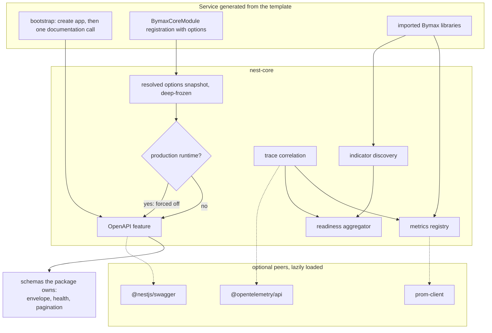

# Spec — Optional integrations: OpenAPI, health auto-discovery, metrics contribution, trace correlation

> **Status**: ✅ Shipped in v1.1.0 &nbsp;·&nbsp; **Owner**: Maximiliano Salvatti &nbsp;·&nbsp; **Last updated**: 2026-08-05
> **Related**: `docs/technical_specification.md` §8 (Health), §9 (Metrics), §11 (What is NOT in the package) · `CHANGELOG.md` [1.1.0]

## What shipped

All four features in scope, each off by default and each loading nothing until enabled:

| Feature                    | Shipped as                                                                          |
| -------------------------- | ----------------------------------------------------------------------------------- |
| OpenAPI documents          | `openapi` options + the `./openapi` subpath's `applyBymaxOpenApi`, development-only |
| Health-indicator discovery | `health.autoDiscover` + `@BymaxHealthIndicator()` on the `./health` subpath         |
| Metrics contribution       | the `./metrics` subpath's `IMetricsContributor` + `@BymaxMetricsContributor()`      |
| Trace correlation          | `telemetry` options + `BYMAX_TRACE_CONTEXT`, read-only                              |

Two things the implementation settled that this document had left open or wrong:

- **The bootstrap helper must run before `app.listen()`**, not merely "after the app is
  created". Mounting the document re-registers routes on the HTTP adapter, and on Express 5
  doing that against an already-initialized application replaces the router — every other
  route, including this package's health endpoints, stops resolving.
- **Markers use a literal metadata key**, not `DiscoveryService.createDecorator()`, which
  mints a random key per module load. This package ships several bundles, so a class
  decorated through a subpath would otherwise carry a different key than the scan running
  from the package root, and nothing would ever be discovered.

Open questions 1, 2, 3 and 4 below were answered by the implementation: the template owns its
bootstrap file, `NODE_ENV` is the production signal (fail-closed), the trace id is published in
a response body only under an explicit opt-in, and contributed metrics carry a documented
prefix and label policy rather than an enforced one. Question 5 was answered by shipping all
four together; question 6 stayed Prometheus-only.

---

## 1. Goal

A service generated from the backend template should get interactive API documentation in development, a readiness endpoint that already knows every Bymax library the service imports, a single Prometheus registry that every library publishes into, and trace identifiers stitched through its errors and timings — by passing options to the `BymaxCoreModule` registration it already has. Nothing extra is installed, nothing is wired by hand, and none of it exists in production unless it is a metrics or health endpoint that belongs there. Every one of the four features is off by default: a service that ignores them pays nothing, loads no optional peer, and registers no provider.

---

## 2. Background — why now

- **The contract is already proven.** `nest-core` v1.0.1 ships the Prometheus metrics endpoint as an optional peer (`prom-client`) behind a lazily-imported factory, a flag that defaults to off, and conditional registration that contributes zero providers when disabled. The pattern is code, not theory — these four features replicate it rather than invent anything.
- **No library in the family documents its own API.** A repository-wide search finds no reference to `@nestjs/swagger` in any of the ten `nest-*` libraries. Every service either hand-rolls its documentation setup or has none, and the two drift apart.
- **The health-indicator contract has no producers.** `IHealthIndicator` and the `BYMAX_HEALTH_INDICATORS` multi-token exist only in `nest-core`. No sibling library ships a ready indicator; `nest-cache` exposes a reachability probe that nobody consumes, and `nest-queue`'s own documentation points consumers at `@nestjs/terminus` — a competitor to the family's own contract.
- **Three observability dialects, no bridge.** `nest-core` owns a `prom-client` registry, `nest-queue` keeps in-memory counters, and `nest-logger`, `nest-ai-tokens` and `nest-queue` speak OpenTelemetry. `BYMAX_METRICS_REGISTRY` is exported today and consumed by nobody, so a service scraping `/metrics` sees process and HTTP metrics and nothing about the queues, caches or budgets it actually runs on.
- **Every new backend re-decides all of this.** The template is the place where that stops being a per-service decision.

---

## 3. Scope

### In (v1)

- **OpenAPI feature.** An `openapi` option block in the same shape as `metrics`: off by default, `@nestjs/swagger` as an optional peer loaded lazily, conditional registration, and a runtime guard on the asynchronous registration path. The library contributes the schemas it already owns — the error envelope and its details, the error-code catalogue, the health response, the offset and cursor page shapes and their query parameters, and the standard error responses — as plain OpenAPI schema objects, never as decorators.
- **A single bootstrap contact point.** One exported helper that receives the created application — after `NestFactory.create`, before it starts listening — reads the resolved options from the container, lazily loads the peer, merges the contributed schemas, and mounts the document and the UI. It is the only place in the package that touches `@nestjs/swagger`. The ordering is load-bearing: mounting re-registers routes on the HTTP adapter, and doing that against an already-initialized Express 5 application replaces the router.
- **Development-only exposure, fail-closed.** The documentation route and the JSON document are never served in production. The guard is enforced twice, independently: the option resolver forces the feature off when the runtime is production, and the bootstrap helper refuses to mount and logs a warning. An unknown or unset runtime environment is treated as production.
- **Health auto-discovery.** The readiness aggregator discovers indicators registered anywhere in the application container, in addition to those registered explicitly under the existing multi-token. Discovery matches an explicit marker the package publishes, not the shape of an object. Results are de-duplicated by indicator name and ordered deterministically. Behind a flag, off by default; explicit registration keeps working unchanged.
- **Metrics contribution contract.** A documented, versioned way for any provider — a sibling library or application code — to obtain the core registry and register its own collectors, plus the naming, prefix and label conventions that keep those metrics collision-free and low-cardinality. The registry token is already exported; this turns an accident into a contract.
- **Trace correlation.** `@opentelemetry/api` as an optional peer, read-only: when a span is active, its trace and span identifiers are attached to the error envelope, to the request-timing sample, and to the metrics the timing bridge emits. Off by default.
- **Uniform optionality.** For all four: disabled means zero providers, zero routes, and no attempt to load the optional peer. Enabling a feature whose peer is missing fails at boot with a message naming the package and the install command.

### Out

- **Indicators or collectors for sibling libraries living inside `nest-core`.** That inverts the dependency and makes the foundation package aware of the packages built on it. Each sibling ships its own, in its own repository, against the contracts this spec publishes.
- **Serving OpenAPI in production, in any form, including behind authentication.** Explicit product decision; there is no escape hatch in v1.
- **Creating spans or bootstrapping the OpenTelemetry SDK.** Both overlap with standard auto-instrumentation and with the operator's own collector setup.
- **Swagger decorators on the package's own types.** Decorators execute when a class is defined, which would make the peer load even with the feature disabled and break the optionality contract.
- **New health endpoints or a change to the existing liveness and readiness contracts.** Auto-discovery changes who is aggregated, never what is served.
- **Replacing `@nestjs/terminus`.** Out of scope here, as it already is in the current specification.

### Future (v2 maybe)

- An explicit, audited opt-in to expose the documentation in production for internal-only deployments.
- A conformance test kit so a sibling library can assert its indicator and its metrics satisfy the contracts without duplicating tests.
- Client generation from the produced document as a step in the template's pipeline.
- Contributing the OpenAPI document itself as a discovered artifact, so sibling libraries can add their own schemas the way they add indicators.

---

## 4. User stories

1. **As a backend developer**, when I import a Bymax library that ships a health indicator, **I want** it to appear in my readiness response **so that** I never wire a check by hand for a dependency the library already understands.
2. **As a backend developer**, **I want** interactive API documentation in development by setting one option, **so that** I neither install nor configure a documentation stack per service.
3. **As an SRE**, **when** I request the documentation route on a production deployment, **I see** the same response as any unknown route and nothing is served, **so that** an internal API surface is never published by an option someone forgot to turn off.
4. **As an SRE**, **I want** one scrape endpoint carrying process, HTTP, and every library's metrics under consistent names and labels, **so that** a single dashboard describes the whole service.
5. **As a developer debugging a production incident**, **when** a request fails, **I want** the error envelope and the log line to carry the same trace identifier, **so that** I move from the response to the trace without correlating by timestamp.
6. **As the template author**, **I want** a new service to receive all four features by passing options to the module registration it already generates, **so that** the template's bootstrap stays one call plus one documentation line.
7. **As a library author** in the family, **I want** published contracts for indicators and metrics, **so that** my library plugs into a service's health and observability without depending on the foundation package at runtime.

---

## 5. Success criteria

| #   | Criterion                                                                                                                                                 | How we verify                                                                                                                                                                                                                                                  |
| --- | --------------------------------------------------------------------------------------------------------------------------------------------------------- | -------------------------------------------------------------------------------------------------------------------------------------------------------------------------------------------------------------------------------------------------------------- |
| 1   | With every new feature disabled, none of the three optional peers is loaded, and the synchronous path registers no provider it did not register before ✅ | The consumer-runtime gate's peer tripwire on the packed tarball, plus module unit tests. The asynchronous path binds its tokens unconditionally by design, since imports and providers cannot be decided after the module is defined                           |
| 2   | With the documentation feature enabled and the runtime resolved as production, no route exists, no document is built, and a warning is logged             | End-to-end test across both registration paths and an unset environment variable                                                                                                                                                                               |
| 3   | The produced document is valid in the dialect the peer emits (OpenAPI 3.0) and contains the envelope, health and pagination schemas the package owns      | End-to-end test asserting the served document over HTTP                                                                                                                                                                                                        |
| 4   | An indicator registered anywhere in the container appears in readiness without explicit registration, and is not duplicated when both mechanisms are used | End-to-end test with a marked provider registered in a separate module                                                                                                                                                                                         |
| 5   | A provider outside the package can register a collector on the core registry and see it in a scrape, under the documented prefix                          | End-to-end test standing in for a sibling library                                                                                                                                                                                                              |
| 6   | With an active span, the same trace identifier appears in the error envelope and in the timing sample; with no active span, nothing changes               | Unit and end-to-end tests with and without the optional peer installed                                                                                                                                                                                         |
| 7   | The root barrel's compressed size grows only by what the features themselves add ⚠️ recalibrated                                                          | The size check. The root moved 8.15 → 11.01 KiB brotli and its budget was recalibrated 11 → 15 KiB at the ratio the script documents; the two new public surfaces landed in their own subpaths, and the peer tripwire proves the growth is not a leaked import |
| 8   | Coverage stays at 100% and mutation score stays at or above the configured threshold                                                                      | The repository's existing coverage and mutation gates                                                                                                                                                                                                          |
| 9   | A service enables all four features with options plus one documentation call and no other local setup                                                     | The reference application, exercised by the dogfood smoke test                                                                                                                                                                                                 |

---

## 6. Technical approach

**One shape, four features.** Each feature is an option block resolved against documented defaults into the frozen snapshot the package already publishes, gated at registration on the synchronous path and guarded at request time on the asynchronous path. Every optional peer is reached exclusively through a single lazily-executed loader per package, mirroring the existing metrics loader, so a disabled feature never resolves the module.

**Documentation is data, not decorators.** The package describes its own types as plain OpenAPI schema objects, typed only through erased type-only imports. The bootstrap helper merges them into the generated document's component schemas. This is what keeps the peer genuinely optional: the alternative — decorating the package's own classes — executes documentation code at class-definition time, whether or not the feature is on.

**The bootstrap helper exists because the framework requires it.** Building and mounting an OpenAPI document requires the application instance, which does not live in the dependency-injection container. Exactly one exported helper receives it, between `NestFactory.create` and `listen`. Everything else — whether the feature is on, at which route, with which title, servers and security schemes, and whether the package's own schemas are contributed — stays in the options the module already accepts.

**Production is a closed door, checked twice.** A single internal predicate decides whether the runtime is production, treating an unset or unrecognized value as production. The option resolver consults it and forces the documentation feature off; the bootstrap helper consults it again and refuses to mount, logging a warning that names the option that was ignored. Neither layer trusts the other, and there is no override.

**Discovery is opt-in on both sides.** The aggregator discovers providers carrying a marker the package publishes, rather than inferring intent from an object's shape, so an unrelated provider that happens to expose a similarly-named method is never scraped into a readiness response. Discovered indicators are merged with explicitly registered ones, de-duplicated by name with explicit registration winning, and ordered deterministically so the response is stable across restarts.

**Metrics contribution is a contract, not a mechanism.** The registry token is exported today; what is missing is the agreement about it — who may register, when in the lifecycle, under which prefix, with which labels, and what happens when two libraries choose the same name. This spec makes those rules normative and testable, so libraries can adopt them independently.

**Correlation is read-only.** The package reads the active span if the optional peer is present and a span exists, and attaches its identifiers. It creates nothing, exports nothing, and configures nothing, so it composes with any collector and any auto-instrumentation the operator already runs.

**Known inherited limitation.** On the asynchronous registration path, route metadata is fixed before options resolve, so a custom documentation route is honored only on the synchronous path — the same constraint the metrics endpoint documents today, and it is documented identically here.

---

## 7. Architecture

---

## 8. Constraints

- **Platform.** NestJS 11 and Node.js 24 or later, unchanged. No runtime dependency is added: all three new peers are optional and lazily loaded.
- **Compatibility.** A minor release. No existing contract changes: the error envelope, the health response, the pagination shapes and every current option keep their meaning, and a service that upgrades without touching its configuration behaves identically.
- **Discovery requires the framework's discovery module**, which comes from an already-required peer, but it must be imported by the feature and only when the feature is enabled.
- **Size budgets.** The new public surface lives in its own subpath so the root barrel's compressed budget is unaffected.
- **A repository gate must be revised.** The reference application's autopilot configuration currently fails the build if `@nestjs/swagger` appears anywhere in the applications directory. That gate predates this feature and has to be narrowed before the reference application can demonstrate it.
- **Security documentation.** The package's security model already treats the metrics endpoint as a route like any other. The documentation route needs the same treatment, plus the production rule stated as a guarantee rather than a default.
- **Quality gates.** The repository's existing gates apply unchanged: strict typing with no escape hatches, 100% coverage, mutation score at or above the configured threshold, published-surface and consumer-runtime checks, and English-only documentation and comments.

---

## 9. Risks

| Risk                                                                                                                                                        | Score      | Mitigation                                                                                                                                         |
| ----------------------------------------------------------------------------------------------------------------------------------------------------------- | ---------- | -------------------------------------------------------------------------------------------------------------------------------------------------- |
| The documentation peer leaks into the disabled path, for example through a decorator or a stray top-level import, silently making an optional peer required | **HIGH**   | Data-only schema contributions; a single lazy loader; an automated check that asserts the module is never resolved with the feature off            |
| Production detection is wrong on a deployment that does not set the expected environment variable, and documentation is served                              | **HIGH**   | Fail-closed: anything not positively recognized as non-production is production; the guard runs in two independent layers; end-to-end coverage     |
| Discovery picks up a provider that was never meant to be a health check, turning an unrelated failure into a failed readiness probe                         | **MEDIUM** | Match an explicit published marker, never an object's shape; the feature is off by default; discovered names are reported in the response          |
| Two libraries register metrics under the same name and the registry throws at boot, or worse, silently double-counts                                        | **MEDIUM** | A normative prefix and label convention; a documented, deterministic failure at registration time rather than at scrape time                       |
| Metric label cardinality explodes once libraries contribute, degrading the scrape                                                                           | **MEDIUM** | Labels restricted by contract to bounded dimensions; route templates rather than raw paths; documented as a review item for contributing libraries |
| Trace identifiers in a client-visible error body expose more than intended                                                                                  | **MEDIUM** | Decide the placement explicitly (see open questions); default to the most conservative placement until decided                                     |
| Discovery only sees instantiated providers, so request-scoped indicators are invisible                                                                      | **LOW**    | Documented limitation; explicit registration remains available for those cases                                                                     |
| A custom documentation route is silently ignored on the asynchronous registration path                                                                      | **LOW**    | Same guard the metrics endpoint uses: a descriptive error at request time, documented in the limitations section                                   |

---

## 10. Open questions

1. **Does the backend template own the generated bootstrap file?** If it does, the single documentation call is written once in the template and no service ever writes it. If services own their bootstrap, the call is one documented line per service. This does not change the design, only how the promise is worded.
2. **Which signal is authoritative for "production" in Bymax services** — the standard Node environment variable, or an application environment resolved by `@bymax-one/nest-config`? The foundation package reads no environment today, and this feature would be the first exception.
3. **Where do trace identifiers belong in the error path** — in the response body alongside the correlation identifier, in a response header only, or in logs only? Body placement is the most useful for support and the most generous to an attacker.
4. **What is the label-cardinality policy for contributed metrics** — specifically whether route labels are allowed at all, and whether tenant identifiers ever appear as labels.
5. **Do the four features ship together as one minor release, or does the documentation feature ship first** and the other three follow? They are independent; only the release sequencing is open.
6. **Should the metrics contribution contract also cover the OpenTelemetry side**, so a library publishes once and both backends see it, or does it stay Prometheus-only in v1?

---

## 11. References

- `docs/technical_specification.md` — §8 Health (indicator contract, why not Terminus), §9 Metrics (optional peer loading, default HTTP metrics), §11 What is NOT in the package, §14 Known Limitations
- `README.md` — Configuration, DI Tokens, Metrics, Security Model sections, which this feature extends rather than replaces
- The reference application's autopilot configuration — the gate that currently forbids the documentation peer
- NestJS OpenAPI documentation — document creation and setup both require the application instance, which is why one bootstrap call is unavoidable
- NestJS discovery documentation — provider discovery and decorator-based metadata matching
